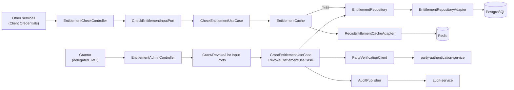
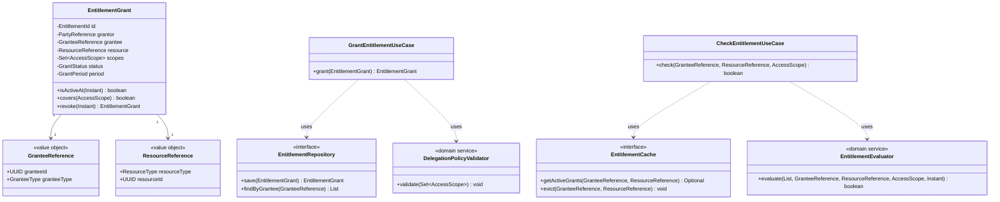
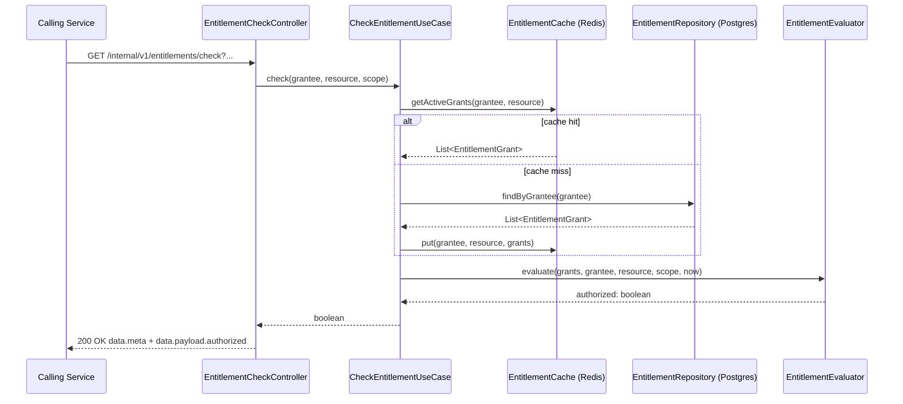

# entitlement-service

## 1. Project Overview

| Field | Value |
|---|---|
| Project name | Entitlement / Delegated Authorization |
| Technical service name | `entitlement-service` |
| BIAN Service Domain | **Customer Access Entitlement** (verified — this is a real, distinct BIAN Service Domain, not a synonym for Party Authentication) |
| Business capability | Grant, revoke, and check delegated access rights that a customer extends over their own accounts/products to a third party (a person, an internal role, or a registered third-party application) |
| Business problem | Open-banking-style access, joint-account delegation, and accountant/advisor access all require a system of record for *who may act on whose behalf, on what, and for how long* — separate from *who someone is* (that's Party Authentication, Project 3) |
| Business actors | Grantor (the customer who owns the resource), Grantee (a person, role, or third-party application receiving access), Resource-owning services (accounts, cards — consumers of the entitlement check), Bank compliance/audit |
| Project purpose | Introduce OAuth2 Client Credentials for machine callers, outbound service-to-service integration, a caching layer for a hot read path, and materially more domain logic than Project 1, while staying imperative |

> **BIAN honesty note.** I independently verified `Customer Access Entitlement` as a real BIAN Service Domain name. I could **not** independently verify its exact node in the BIAN Business Area / Business Domain hierarchy from public sources at the depth I'd want for a "non-negotiable" claim — the public service-domain index confirms the name and role, not the full landscape coordinates. Treat the "Business Area: Customer Management" placement below as my best-supported placement, and confirm against your organization's licensed BIAN portal before using it in an actual interview claim.

## 2. Business Context and Functional Scope

**Business scenario.** A customer wants their accountant to view (but not move money on) their business current account, and separately wants to authorize a budgeting fintech app to read transaction data under an open-banking consent. Both are the same underlying capability: the customer (grantor) creates a time-bound, scope-bound entitlement for a grantee over a specific resource. Every other service in the bank that guards a sensitive operation (view balance, initiate payment, close account) calls `entitlement-service` to check whether the caller's grant covers the action before proceeding.

**Actors.**
- **Grantor** — the customer, authenticated via delegated JWT, creates and revokes grants over their own resources.
- **Grantee** — a person (has their own JWT `sub`) or a third-party application (identified by `azp` in a client-credentials token).
- **Resource-owning services** (e.g. a future accounts service) — call the internal check endpoint with Client Credentials to authorize an action.
- **Compliance/audit** — consumes the audit trail this service emits on every grant/revoke.

**Main use cases.**
1. Grant an entitlement (scope + resource + optional expiry) from a grantor to a grantee.
2. Revoke an entitlement before its natural expiry.
3. Check whether a grantee holds a specific scope over a specific resource, right now (the hot path — called synchronously by other services before they act).
4. List entitlements a grantor has issued.
5. List entitlements a grantee currently holds.

**Functional requirements.**
- FR1: A grant has one or more `AccessScope`s from a fixed enumeration (`READ_BALANCE`, `READ_TRANSACTIONS`, `INITIATE_PAYMENT`, `MANAGE_STANDING_ORDERS`).
- FR2: A grant may carry an expiry; an expired grant is treated as inactive without requiring an explicit revoke.
- FR3: `INITIATE_PAYMENT` may never be granted without `READ_BALANCE` also present (a payment-initiation delegate must be able to see the balance it's spending against) — enforced by `DelegationPolicyValidator`.
- FR4: The check endpoint (§6) must answer in well under 50 ms on a cache hit; this is the endpoint every other service's request path depends on.
- FR5: Revoking a grant is immediate and must invalidate any cached "active" result for that grant.

**Non-functional requirements.**
- NFR1: Check-endpoint P95 latency under 30 ms including cache round-trip.
- NFR2: Grant/revoke actions are audited (who, what, when) and the audit call failing must not silently swallow the grant/revoke itself — but it also must not block on audit-service downtime beyond a bounded timeout (§7).

**Explicitly out of scope.** Verifying the grantor's *identity* at grant time (delegated to Party Authentication, integrated as an external call, not re-implemented here); consent-lifecycle UI/UX; open-banking regulatory reporting.

## 3. Architecture and Learning Objectives

| Attribute | Value |
|---|---|
| Difficulty | Intermediate |
| Classification | Imperative (Spring MVC, blocking I/O throughout, including the outbound calls) |
| Technologies | Java 21, Spring Boot 3, Spring MVC, Spring Data JPA, PostgreSQL, Spring Data Redis (blocking `RedisTemplate`), Spring Security OAuth2 (Resource Server + Client Credentials), `RestClient` |
| Architectural concepts | Read-through cache as an infrastructure decorator, outbound adapters as first-class output ports, "call another BIAN Service Domain over HTTP" as a real integration pattern |
| Java concepts | `EnumSet` for scope collections, `Duration`/`Instant` expiry math, defensive copying of mutable collections at aggregate boundaries |
| Spring concepts | `RestClient` (or `RestTemplate`) with connection/read timeouts, `@Cacheable`-style thinking done explicitly through a port instead of an annotation (so the domain stays cache-agnostic), OAuth2 Client Credentials as both a provider (this service issuing tokens to call others) and a consumer (this service validating tokens from others) |
| Clean Architecture concepts | Why the cache is an **adapter behind an output port**, not a `@Cacheable` annotation on the use case — the domain must not know Redis exists |
| Banking concepts | Delegated authority vs. identity, scope composition rules, grant expiry as a first-class business rule |
| Why this project exists in the progression | It's the first project where a use case calls *out* to another service, and the first with a genuine hot-path performance constraint. Both of those recur, amplified, in every later project. |

**What I should understand before starting Project 3:** how an output port can have more than one adapter (cache-backed and DB-backed) composed together in infrastructure wiring without the use case knowing; how a blocking outbound HTTP call behaves under load — because Project 3 replaces exactly this kind of call with a reactive one and explains why.

**Component / architecture diagram.**



## 4. Detailed Domain Model

**Entities.**

| Entity | Attributes | Notes |
|---|---|---|
| `EntitlementGrant` | `id: EntitlementId`, `grantor: PartyReference`, `grantee: GranteeReference`, `resource: ResourceReference`, `scopes: Set<AccessScope>`, `status: GrantStatus` (`ACTIVE`, `REVOKED`, `EXPIRED`), `period: GrantPeriod`, `revokedAt: Optional<Instant>` | Aggregate root |

**Value objects.**

| Value object | Attributes | Invariants |
|---|---|---|
| `PartyReference` | `partyId: UUID` | non-null |
| `GranteeReference` | `granteeId: UUID`, `granteeType: GranteeType` (`INDIVIDUAL`, `THIRD_PARTY_APP`) | non-null |
| `ResourceReference` | `resourceType: ResourceType` (`ACCOUNT`, `CARD`, `PRODUCT`), `resourceId: UUID` | non-null |
| `AccessScope` | enum value | fixed enumeration, see FR1 |
| `GrantPeriod` | `grantedAt: Instant`, `expiresAt: Optional<Instant>` | if present, `expiresAt > grantedAt` |

**Domain services.**

| Service | Responsibility |
|---|---|
| `DelegationPolicyValidator` | Enforces cross-scope business rules (FR3) at grant-creation time |
| `EntitlementEvaluator` | Given a grant and a requested `(GranteeReference, ResourceReference, AccessScope)`, decides `true`/`false`, accounting for status and expiry — this is the logic behind the hot-path check |

**Domain exceptions.**

| Exception | Raised when |
|---|---|
| `EntitlementNotFoundException` | Grant ID doesn't exist |
| `EntitlementAlreadyRevokedException` | Revoking an already-revoked grant |
| `InvalidDelegationScopeException` | FR3 violated |
| `ExpiredEntitlementException` | An operation is attempted against a grant whose `expiresAt` has passed |

**Domain model vs. persistence model vs. API DTO.** `scopes` is a `Set<AccessScope>` in the domain but a comma-joined `VARCHAR` column in Postgres (simpler than a join table for a small, fixed enum — a deliberate, explainable trade-off, not an oversight). The API DTO expresses `scopes` as a JSON array of strings and never exposes `GrantStatus.EXPIRED` as a status the client can set directly — expiry is always derived, never client-supplied.

## 5. Detailed Class and Package Specification

**Package root:** `com.banking.entitlement`

```text
Domain layer
- 1 entity (EntitlementGrant)
- 5 value objects (PartyReference, GranteeReference, ResourceReference, AccessScope, GrantPeriod)
- 2 domain services (DelegationPolicyValidator, EntitlementEvaluator)
- 4 domain exceptions

Application layer
- 5 use cases
- 5 input ports
- 4 output ports (repository, cache, party verification client, audit publisher)
- 4 DTOs
- 3 mappers

Infrastructure layer
- 2 REST controllers
- 4 persistence classes
- 1 cache adapter
- 2 outbound REST client adapters
- 2 security classes
- 2 exception-handling classes
- 3 configuration classes
```

### Domain layer

```text
Class: EntitlementGrant
Package: com.banking.entitlement.domain.model
Layer: Domain / Entity (aggregate root)
Attributes: id: EntitlementId; grantor: PartyReference; grantee: GranteeReference;
            resource: ResourceReference; scopes: Set<AccessScope>; status: GrantStatus;
            period: GrantPeriod; revokedAt: Optional<Instant>
Methods:
+ isActiveAt(Instant now): boolean       [status == ACTIVE && !period.isExpiredAt(now)]
+ covers(AccessScope scope): boolean
+ revoke(Instant now): EntitlementGrant  [returns a new instance with status=REVOKED, revokedAt=now]

Record: PartyReference / GranteeReference / ResourceReference / GrantPeriod
Enum: AccessScope { READ_BALANCE, READ_TRANSACTIONS, INITIATE_PAYMENT, MANAGE_STANDING_ORDERS }
Enum: GranteeType { INDIVIDUAL, THIRD_PARTY_APP }
Enum: ResourceType { ACCOUNT, CARD, PRODUCT }
Enum: GrantStatus { ACTIVE, REVOKED, EXPIRED }
Package (all above): com.banking.entitlement.domain.model
```

```text
Class: DelegationPolicyValidator
Package: com.banking.entitlement.domain.service
Method: + validate(Set<AccessScope> scopes): void   [throws InvalidDelegationScopeException]

Class: EntitlementEvaluator
Package: com.banking.entitlement.domain.service
Method: + evaluate(List<EntitlementGrant> candidateGrants, GranteeReference grantee,
                    ResourceReference resource, AccessScope scope, Instant now): boolean
```

```text
Classes: EntitlementNotFoundException, EntitlementAlreadyRevokedException,
         InvalidDelegationScopeException, ExpiredEntitlementException  (extend RuntimeException)
Package: com.banking.entitlement.domain.exception
```

### Application layer

```text
Interfaces (input ports), package com.banking.entitlement.domain.usecase.port.in:
GrantEntitlementInputPort       + grant(EntitlementGrant grant): EntitlementGrant
RevokeEntitlementInputPort      + revoke(EntitlementId id): EntitlementGrant
CheckEntitlementInputPort       + check(GranteeReference grantee, ResourceReference resource,
                                         AccessScope scope): boolean
ListGrantorEntitlementsInputPort + listForGrantor(PartyReference grantor): List<EntitlementGrant>
ListGranteeEntitlementsInputPort + listForGrantee(GranteeReference grantee): List<EntitlementGrant>

Interfaces (output ports), package com.banking.entitlement.domain.usecase.port.out:
EntitlementRepository
  + save(EntitlementGrant grant): EntitlementGrant
  + findById(EntitlementId id): Optional<EntitlementGrant>
  + findByGrantor(PartyReference grantor): List<EntitlementGrant>
  + findByGrantee(GranteeReference grantee): List<EntitlementGrant>
EntitlementCache
  + getActiveGrants(GranteeReference grantee, ResourceReference resource): Optional<List<EntitlementGrant>>
  + put(GranteeReference grantee, ResourceReference resource, List<EntitlementGrant> grants): void
  + evict(GranteeReference grantee, ResourceReference resource): void
PartyVerificationClient
  + verifyPartyIsActive(PartyReference party): boolean
AuditPublisher
  + publishGrantEvent(EntitlementGrant grant, String action): void
```

```text
Class: GrantEntitlementUseCase implements GrantEntitlementInputPort
Package: com.banking.entitlement.domain.usecase
Dependencies: EntitlementRepository, DelegationPolicyValidator, PartyVerificationClient, AuditPublisher
Logic: verify grantor is active via PartyVerificationClient -> validate scopes via
       DelegationPolicyValidator -> save -> publishGrantEvent("GRANTED").

Class: RevokeEntitlementUseCase implements RevokeEntitlementInputPort
Dependencies: EntitlementRepository, EntitlementCache, AuditPublisher
Logic: load -> reject if already revoked -> revoke() -> save -> cache.evict(...) -> publish("REVOKED").

Class: CheckEntitlementUseCase implements CheckEntitlementInputPort
Dependencies: EntitlementRepository, EntitlementCache, EntitlementEvaluator
Logic: cache.getActiveGrants(...) on miss -> repository.findByGrantee(...) filtered by resource,
       cache.put(...) -> EntitlementEvaluator.evaluate(...).

Class: ListGrantorEntitlementsUseCase / ListGranteeEntitlementsUseCase
Dependencies: EntitlementRepository
Package (all use cases): com.banking.entitlement.domain.usecase
```

### Infrastructure layer

```text
Class: EntitlementAdminController
Package: com.banking.entitlement.infrastructure.entrypoint.rest
Endpoints:
+ POST   /v1/entitlements                         -> grant(...)      [delegated JWT, sub == grantor]
+ DELETE /v1/entitlements/{id}                     -> revoke(...)
+ GET    /v1/entitlements?grantorId=...            -> listForGrantor(...)
+ GET    /v1/entitlements?granteeId=...            -> listForGrantee(...)

Class: EntitlementCheckController
Package: com.banking.entitlement.infrastructure.entrypoint.rest
Endpoint:
+ GET /internal/v1/entitlements/check?granteeId=&resourceType=&resourceId=&scope=  -> check(...)
  Security: OAuth2 Client Credentials only, scope entitlement:check — never called with a user JWT.
```

```text
Class: EntitlementJpaEntity
Package: com.banking.entitlement.infrastructure.drivenadapter.jpa.entity
Columns: id, grantor_party_id, grantee_id, grantee_type, resource_type, resource_id,
         scopes (VARCHAR, comma-joined), status, granted_at, expires_at, revoked_at

Interface: SpringDataEntitlementJpaRepository extends JpaRepository<EntitlementJpaEntity, UUID>
Class: EntitlementRepositoryAdapter implements EntitlementRepository
Class: EntitlementPersistenceMapper
Package (all three): com.banking.entitlement.infrastructure.drivenadapter.jpa
```

```text
Class: RedisEntitlementCacheAdapter implements EntitlementCache
Package: com.banking.entitlement.infrastructure.drivenadapter.redis
Dependencies: RedisTemplate<String, String> (values serialized as JSON), fixed TTL 60s
  (short TTL is deliberate: correctness on a security-relevant check matters more than hit rate,
   and RevokeEntitlementUseCase explicitly evicts on revoke so the TTL is a safety net, not the
   primary consistency mechanism).
```

```text
Class: PartyVerificationRestClientAdapter implements PartyVerificationClient
Package: com.banking.entitlement.infrastructure.drivenadapter.restclient
Dependencies: RestClient configured with a 500ms connect / 1s read timeout and a Resilience4j
              CircuitBreaker("party-verification"); on circuit-open, fails closed (returns false)
              — a delegation grant must never be created if identity verification is unreachable.

Class: AuditEventRestClientAdapter implements AuditPublisher
Package: com.banking.entitlement.infrastructure.drivenadapter.restclient
Dependencies: RestClient with a 300ms timeout wrapped in Resilience4j Retry(2) + a bulkhead;
              failure to publish an audit event is logged as a business_errors_total increment
              but does NOT roll back the grant/revoke transaction (fire-and-log, not fire-and-forget —
              the failure is observable, just not blocking).
```

```text
Classes: ResourceServerSecurityConfig, ClientCredentialsTokenConfig
Package: com.banking.entitlement.infrastructure.config
Responsibility: JWT resource server for inbound calls; RestClient interceptor that obtains and
                caches a Client Credentials token for outbound calls to party-authentication-service
                and audit-service.

Classes: GlobalExceptionHandler, ApiError
Package: com.banking.entitlement.infrastructure.entrypoint.rest.exception

Classes: RedisConfig, RestClientConfig, OpenApiConfig
Package: com.banking.entitlement.infrastructure.config
```

**Class diagram.**



## 6. API and OpenAPI Contract

| Method | Path | Purpose | Auth |
|---|---|---|---|
| POST | `/v1/entitlements` | Grant an entitlement | Delegated JWT, `sub` must equal `grantorId` |
| DELETE | `/v1/entitlements/{id}` | Revoke an entitlement | Delegated JWT, `sub` must equal the grant's `grantorId` |
| GET | `/v1/entitlements` | List grants (by `grantorId` or `granteeId`) | Delegated JWT |
| GET | `/internal/v1/entitlements/check` | Hot-path authorization check | Client Credentials, scope `entitlement:check` |

**Main request flow (hot-path entitlement check).**



```yaml
openapi: 3.0.3
info:
  title: Entitlement Service API
  description: Delegated access-rights management aligned to the BIAN Customer Access Entitlement Service Domain.
  version: 1.0.0
servers:
  - url: https://api.bank.internal/entitlement-service
paths:
  /v1/entitlements:
    post:
      summary: Grant a delegated entitlement
      security:
        - bearerAuth: [entitlement:manage]
      requestBody:
        required: true
        content:
          application/json:
            schema: { $ref: '#/components/schemas/GrantEntitlementRequest' }
      responses:
        '201':
          description: Entitlement created
          content:
            application/json:
              schema: { $ref: '#/components/schemas/EntitlementEnvelope' }
              example:
                data:
                  meta:
                    clientId: "mobile-app"
                    timestamp: "2026-09-17T15:00:00Z"
                    messageId: "3f7e2b10-aaaa-4b1a-9c1e-1a2b3c4d5e6f"
                  payload:
                    id: "9e0a1b2c-3333-4d7a-9c1e-1a2b3c4d5e6f"
                    grantorId: "1a2b3c4d-0000-4d7a-9c1e-1a2b3c4d5e6f"
                    granteeId: "77778888-0000-4d7a-9c1e-1a2b3c4d5e6f"
                    granteeType: "THIRD_PARTY_APP"
                    resourceType: "ACCOUNT"
                    resourceId: "1a2b3c4d-0000-4d7a-9c1e-1a2b3c4d5e6f"
                    scopes: ["READ_BALANCE", "READ_TRANSACTIONS"]
                    status: "ACTIVE"
                    grantedAt: "2026-09-17T15:00:00Z"
                    expiresAt: "2026-12-17T15:00:00Z"
        '422':
          $ref: '#/components/responses/UnprocessableEntity'
        '400':
          $ref: '#/components/responses/BadRequest'
    get:
      summary: List entitlements for a grantor or grantee
      security:
        - bearerAuth: [entitlement:read]
      parameters:
        - in: query
          name: grantorId
          schema: { type: string, format: uuid }
        - in: query
          name: granteeId
          schema: { type: string, format: uuid }
      responses:
        '200':
          description: List of entitlements
          content:
            application/json:
              schema: { $ref: '#/components/schemas/EntitlementListEnvelope' }
  /v1/entitlements/{id}:
    delete:
      summary: Revoke an entitlement
      security:
        - bearerAuth: [entitlement:manage]
      parameters:
        - in: path
          name: id
          required: true
          schema: { type: string, format: uuid }
      responses:
        '200':
          description: Entitlement revoked
          content:
            application/json:
              schema: { $ref: '#/components/schemas/EntitlementEnvelope' }
        '409':
          $ref: '#/components/responses/Conflict'
        '404':
          $ref: '#/components/responses/NotFound'
  /internal/v1/entitlements/check:
    get:
      summary: Check whether a grantee holds a scope over a resource, right now
      security:
        - oauth2ClientCredentials: [entitlement:check]
      parameters:
        - in: query
          name: granteeId
          required: true
          schema: { type: string, format: uuid }
        - in: query
          name: resourceType
          required: true
          schema: { type: string, enum: [ACCOUNT, CARD, PRODUCT] }
        - in: query
          name: resourceId
          required: true
          schema: { type: string, format: uuid }
        - in: query
          name: scope
          required: true
          schema: { type: string, enum: [READ_BALANCE, READ_TRANSACTIONS, INITIATE_PAYMENT, MANAGE_STANDING_ORDERS] }
      responses:
        '200':
          description: Boolean authorization result
          content:
            application/json:
              schema: { $ref: '#/components/schemas/CheckResultEnvelope' }
              example:
                data:
                  meta:
                    clientId: "accounts-service"
                    timestamp: "2026-09-17T15:05:00Z"
                    messageId: "aabbccdd-eeff-4b1a-9c1e-1a2b3c4d5e6f"
                  payload:
                    authorized: true
components:
  schemas:
    GrantEntitlementRequest:
      type: object
      required: [grantorId, granteeId, granteeType, resourceType, resourceId, scopes]
      properties:
        grantorId: { type: string, format: uuid }
        granteeId: { type: string, format: uuid }
        granteeType: { type: string, enum: [INDIVIDUAL, THIRD_PARTY_APP] }
        resourceType: { type: string, enum: [ACCOUNT, CARD, PRODUCT] }
        resourceId: { type: string, format: uuid }
        scopes:
          type: array
          items: { type: string, enum: [READ_BALANCE, READ_TRANSACTIONS, INITIATE_PAYMENT, MANAGE_STANDING_ORDERS] }
        expiresAt: { type: string, format: date-time, nullable: true }
    Entitlement:
      type: object
      properties:
        id: { type: string, format: uuid }
        grantorId: { type: string, format: uuid }
        granteeId: { type: string, format: uuid }
        granteeType: { type: string }
        resourceType: { type: string }
        resourceId: { type: string, format: uuid }
        scopes: { type: array, items: { type: string } }
        status: { type: string }
        grantedAt: { type: string, format: date-time }
        expiresAt: { type: string, format: date-time, nullable: true }
    Meta:
      type: object
      properties:
        clientId: { type: string }
        timestamp: { type: string, format: date-time }
        messageId: { type: string, format: uuid }
    EntitlementEnvelope:
      type: object
      properties:
        data:
          type: object
          properties:
            meta: { $ref: '#/components/schemas/Meta' }
            payload: { $ref: '#/components/schemas/Entitlement' }
    EntitlementListEnvelope:
      type: object
      properties:
        data:
          type: object
          properties:
            meta: { $ref: '#/components/schemas/Meta' }
            payload:
              type: array
              items: { $ref: '#/components/schemas/Entitlement' }
    CheckResultEnvelope:
      type: object
      properties:
        data:
          type: object
          properties:
            meta: { $ref: '#/components/schemas/Meta' }
            payload:
              type: object
              properties:
                authorized: { type: boolean }
    ApiErrorEnvelope:
      type: object
      properties:
        data:
          type: object
          properties:
            meta: { $ref: '#/components/schemas/Meta' }
            payload:
              type: object
              properties:
                code: { type: string }
                message: { type: string }
  responses:
    BadRequest:
      description: Validation error
      content: { application/json: { schema: { $ref: '#/components/schemas/ApiErrorEnvelope' } } }
    UnprocessableEntity:
      description: Business rule violation (e.g. INITIATE_PAYMENT without READ_BALANCE)
      content: { application/json: { schema: { $ref: '#/components/schemas/ApiErrorEnvelope' } } }
    NotFound:
      description: Entitlement not found
      content: { application/json: { schema: { $ref: '#/components/schemas/ApiErrorEnvelope' } } }
    Conflict:
      description: Entitlement already revoked
      content: { application/json: { schema: { $ref: '#/components/schemas/ApiErrorEnvelope' } } }
  securitySchemes:
    bearerAuth: { type: http, scheme: bearer, bearerFormat: JWT }
    oauth2ClientCredentials:
      type: oauth2
      flows:
        clientCredentials:
          tokenUrl: https://auth.bank.internal/oauth2/token
          scopes:
            entitlement:manage: Grant/revoke entitlements
            entitlement:read: List entitlements
            entitlement:check: Perform the hot-path authorization check
```

## 7. Error Handling and Security

| Business error code | HTTP | Description | Layer | Exception |
|---|---|---|---|---|
| `ENT-404-001` | 404 | Entitlement not found | Application | `EntitlementNotFoundException` |
| `ENT-409-001` | 409 | Entitlement already revoked | Application | `EntitlementAlreadyRevokedException` |
| `ENT-422-001` | 422 | `INITIATE_PAYMENT` requested without `READ_BALANCE` | Domain (`DelegationPolicyValidator`) | `InvalidDelegationScopeException` |
| `ENT-410-001` | 410 | Grant has expired | Application | `ExpiredEntitlementException` |
| `ENT-502-001` | 502 | Party verification service unreachable / circuit open | Infrastructure | `CallNotPermittedException` (Resilience4j) |
| `ENT-TECH-500` | 500 | Unhandled exception | Infrastructure | `Exception` |

**Security in depth.**
- **Inbound, delegated:** JWT Bearer with `sub` = the authenticated party. The controller enforces `sub == grantorId` on grant/revoke — a customer can only manage their own grants.
- **Inbound, service-to-service:** OAuth2 Client Credentials, scope `entitlement:check`, restricted to the internal mesh (not exposed through the public API gateway at all).
- **Outbound:** this service is itself a Client Credentials *consumer* when calling `party-authentication-service` and `audit-service` — its own client secret is mounted from a Kubernetes `Secret` sourced from AWS Secrets Manager and rotated on a schedule managed outside application code.
- **Fail-closed principle:** any ambiguity in the identity-verification call (timeout, circuit open, 5xx) results in the grant being **refused**, never silently allowed — this is stated explicitly because it's the kind of decision an interviewer will probe.

## 8. Persistence and Infrastructure

```sql
CREATE TABLE entitlement_grant (
    id                 UUID PRIMARY KEY,
    grantor_party_id   UUID NOT NULL,
    grantee_id         UUID NOT NULL,
    grantee_type       VARCHAR(20) NOT NULL,
    resource_type      VARCHAR(20) NOT NULL,
    resource_id        UUID NOT NULL,
    scopes             VARCHAR(200) NOT NULL,
    status             VARCHAR(10) NOT NULL,
    granted_at         TIMESTAMPTZ NOT NULL,
    expires_at         TIMESTAMPTZ,
    revoked_at         TIMESTAMPTZ
);

CREATE INDEX idx_ent_grantor ON entitlement_grant (grantor_party_id);
CREATE INDEX idx_ent_grantee_resource ON entitlement_grant (grantee_id, resource_type, resource_id);
```

`idx_ent_grantee_resource` is what the check use case's cache-miss path relies on — it is the single most latency-sensitive index in the whole portfolio so far.

**Redis:** key shape `entitlement:check:{granteeId}:{resourceType}:{resourceId}`, value is a JSON array of active grant summaries, TTL 60s, explicit eviction on revoke (§5).

**Kubernetes** (delta from Project 1 — same Deployment/Service/ConfigMap/Secret shape, namespace `banking-identity`, plus a Redis dependency):

```yaml
apiVersion: v1
kind: Service
metadata:
  name: entitlement-service-redis
  namespace: banking-identity
spec:
  selector: { app: entitlement-service-redis }
  ports: [{ port: 6379, targetPort: 6379 }]
```

Resource requests/limits: `cpu: 300m / 600m`, `memory: 640Mi / 1Gi` (slightly higher than Project 1 to account for the Redis client connection pool and outbound HTTP clients). HPA min 2 / max 8 — the check endpoint is the highest-QPS endpoint in the identity domain.

**AWS.**

| Service | Why |
|---|---|
| RDS PostgreSQL | System of record for grants |
| ElastiCache (Redis) | Backs `EntitlementCache`; Multi-AZ with automatic failover, because a cache outage must degrade to "always hit the DB," not "always deny" |
| Secrets Manager | This service's own OAuth2 client secret, DB credentials |
| CloudWatch | Alarms on `business_errors_total{code="ENT-502-001"}` — a spike means the identity dependency is unhealthy |
| IAM (IRSA) | Least-privilege access to Secrets Manager and ElastiCache |

## 9. Observability, Privacy, SLA and Production Requirements

**Logs:** same field set as Project 1, plus `downstreamService` and `downstreamLatencyMs` on any log line that resulted from an outbound call, so a slow party-verification call is immediately attributable.

**Metrics:** `http_requests_total`, `http_request_duration_seconds`, `business_operations_total{operation="grant"|"revoke"|"check"}`, `business_errors_total{code}`, `external_service_latency_seconds{target="party-authentication"|"audit"}`, `cache_hit_ratio{cache="entitlement-check"}`.

**Tracing:** OpenTelemetry spans now cross a service boundary for the first time in the portfolio — `party-authentication` and `audit-service` calls propagate the trace context via the `traceparent` header, so a single trace shows grant creation end-to-end across two services.

**Privacy.** This service holds no financial amounts, but it does hold access-relationship data (who can see whose account) which is itself sensitive metadata. Controls: encryption at rest/in transit, scope-based access, and audit-event emission on every grant/revoke as a compliance control (not a compliance guarantee — the actual retention and reportability of that audit trail is an organizational decision).

**SLA.**

| Target | Value | Rationale |
|---|---|---|
| Availability | 99.95% | Every protected operation elsewhere in the bank depends on the check endpoint being up |
| P95 latency (check) | < 30 ms | Cache-hit dominant path |
| P95 latency (grant/revoke) | < 300 ms | Includes a synchronous outbound call |
| Throughput | 2000 RPS (check), 50 RPS (grant/revoke) | Check is called on nearly every protected request bank-wide |
| Timeout (party verification) | 500 ms connect / 1s read | Fail fast, fail closed |
| Retry | Party verification: none (fail closed immediately); Audit publish: 2 retries, non-blocking |
| Error budget | ~22 min/month | Derived from 99.95% |

## 10. CI/CD and Deployment Strategy

Same pipeline shape as Project 1, with one addition: a **contract test stage that pins the outbound contract against `party-authentication-service`'s published OpenAPI** (consumer-driven contract, verified in CI before deploy — not implemented here, only positioned in the pipeline).

```text
Build → Unit Tests → Integration Tests → Contract Tests (inbound + outbound)
→ Acceptance Tests → Performance Tests → Security Checks → Container Build
→ Deploy Dev → Deploy Sandbox → Approval → Deploy Release
```

**Repository layout** (adds a second driven-adapter and a second entry-point controller vs. Project 1):

```text
entitlement-service/
├── domain/{model,usecase}
├── infrastructure/
│   ├── driven-adapters/
│   │   ├── jpa-postgresql/
│   │   ├── redis-cache/
│   │   └── rest-consumer/        # party-verification + audit clients
│   └── entry-points/
│       └── api-rest/
├── application/config/
├── deployment/ k8s/ openapi/
```

## 11. Interview Preparation and Portfolio Evaluation

**Java.** Why `EnumSet`/`Set<AccessScope>` over a `List`? How does `Optional<Instant> expiresAt` avoid null-checking scattered through the codebase?

**Spring.** Difference between `RestTemplate` and `RestClient`; why configure explicit connect/read timeouts rather than rely on defaults; how OAuth2 Client Credentials token acquisition and caching works on the outbound side.

**Clean Architecture.** Why is `EntitlementCache` a separate output port from `EntitlementRepository` rather than caching inside the repository adapter? What would you lose by making the cache a `@Cacheable` annotation on the use case instead?

**BIAN.** Why is Customer Access Entitlement a *different* Service Domain from Party Authentication, and why does that separation matter architecturally (this project calls that project, rather than reimplementing identity checks)?

**REST/API design.** Why is the check endpoint under `/internal/` and never exposed through the public gateway? Why GET with query parameters rather than POST with a body for the check?

**Security.** Explain the fail-closed decision on circuit-breaker-open during identity verification. Why does this service need to be both an OAuth2 resource server *and* an OAuth2 client at the same time?

**Database.** Why is `scopes` a denormalized `VARCHAR` instead of a join table here, and when would that decision need to be revisited?

**AWS/Kubernetes.** Why does ElastiCache need Multi-AZ if the cache is "just" a performance optimization? What's the blast radius if it's down?

**System design.** The check endpoint is the highest-QPS endpoint in the identity domain — walk through what happens end-to-end on a cache miss under a traffic spike, and where you'd add a second layer of protection (expected: request coalescing / local in-memory near-cache, foreshadowing Project 4's reactive session cache).

**Coding exercise.** Implement `DelegationPolicyValidator.validate()` and `EntitlementEvaluator.evaluate()` exactly as specified in §5.

**GitHub evidence to show:** the Resilience4j circuit breaker configuration and a note in the README explaining the fail-closed decision explicitly — this is the single most interview-relevant design decision in this project.
